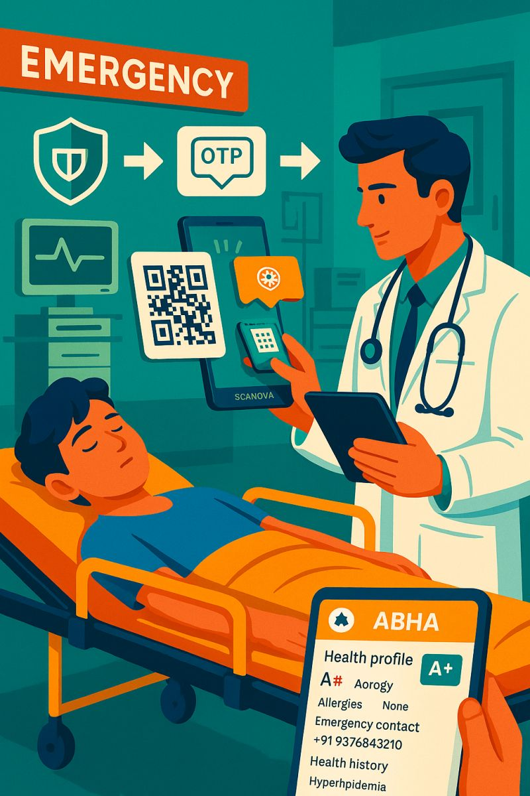

 🆔 Emergency QR Identity Case Study

> “What if a tiny QR code could save lives?”  
This case study explores a real-world product concept: Emergency QR Identity Cards. Designed for scenarios where patients are unconscious or unidentified, this system enables instant access to medical info via QR.

---

 🖼️ Visual Preview

---

 📄 Full Case Study Document

👉 [Read the Full Case Study (Google Doc)](https://docs.google.com/document/d/1pqI6QxI--yE33_JOodoz7Ap9C2EK6tI21yojXlIijmo/edit)

---

📌 Overview

- Objective: Provide instant emergency details (blood type, allergies, contact) through a scannable card
- Tech Stack: Scanova QR + ABHA integration
- User Persona: Hospitals, paramedics, and patients
- Ethics: Privacy-first design, national data handling
- Storyline: Includes a real-life use case with “Rani,” a trauma patient
- Outcome: Higher survival chance, smoother ER processes, scalable at national level

---

 🎯 Audience

- Product thinkers, public health experts, UX designers, and govtech builders

---
 🔗 Credits

- 🧠 **Created by**: Pujitha Pasupuleti 
- 🌐 [LinkedIn Post](https://www.linkedin.com/posts/pujitha-pasupuleti_productthinking-womenintech-scanova-activity-7344323422782427136-bBoT?utm_source=chatgpt.com)

---
thank you!!

